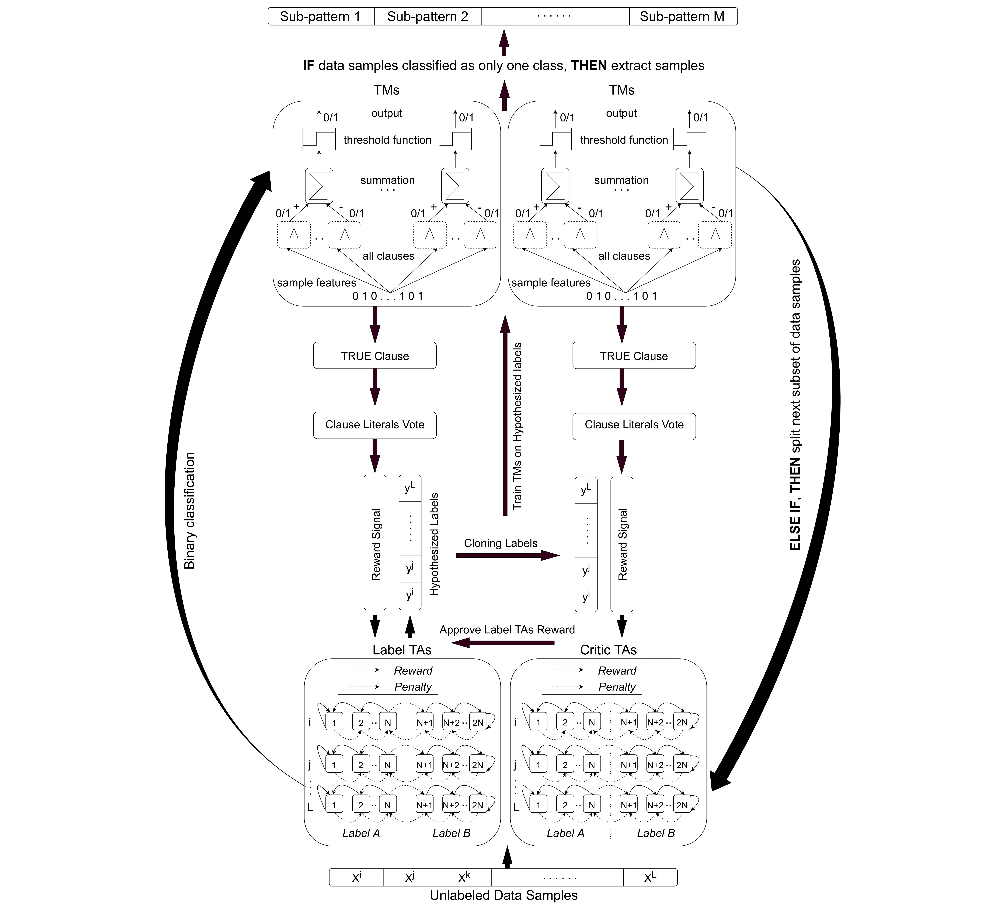

# Label-Critic TM for Self Supervised Learning
Implements the Self-Supervised Tsetlin Machine to learn classification tasks without ground truthes. The repository also include the classic Tsetlin Machine, Coalesced Tsetlin Machine, Convolutional Tsetlin Machine, Regression Tsetlin Machine, and Weighted Tsetlin Machine, with support for continuous features and drop clause. Self-Supervised-TM is written in Python with wrappers for C and CUDA-based clause evaluation and updating.

## Architecture

## To reproduce the guess game expirements on synthetic data, from examples, run:

python synthetic_lctm.py

## To reproduce the guess game expirements on semi-synthetic data, from example, run:

python mnist_lctm_augmented.py

## To reproduce the guess game expirements on MNIST data, from example, run:

python mnist_lctm.py

## For cluster interpretability, from examplesm run:

python mnist_interpret_clusters.py

